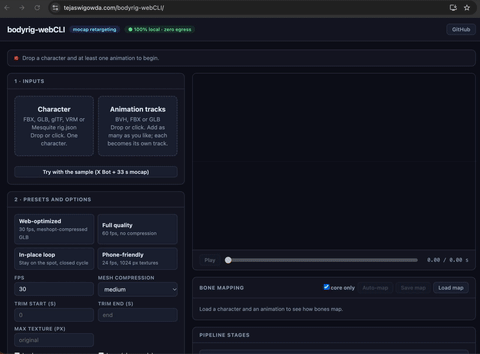

# bodyrig-webCLI

A browser-based mocap retargeting tool: load a skinned character (FBX, GLB, VRM) and any number of animations (BVH, FBX or GLB), retarget each onto the character's **own skeleton**, and export one animated, optimized **GLB** that carries every animation as its own track.
<b><ins>No uploads, no servers: everything happens in your browser.</ins></b> Pure ES modules, no build step for the app (three.js and the optimizer are vendored in `docs/vendor`, so the whole app is same-origin and works offline).


<br>
<sub>Demo: characters from <a target='_blank' href="https://www.mixamo.com">Mixamo</a> (Adobe). See <a href="#attribution">Attribution</a>.</sub>

> **The output is a standard glTF 2.0 file, so it drops into any renderer or engine and plays natively.** Every animation is embedded as its own named clip on the character's own skeleton, with no runtime retargeting, no plugin and no custom player code: load the GLB, pick a clip by name, play it. That works in three.js, Babylon.js, model-viewer, Godot and Blender, and in other engines through their glTF importers.
>
> ```js
> // three.js
> const gltf = await new GLTFLoader().setMeshoptDecoder(MeshoptDecoder).loadAsync('hero.glb');
> const mixer = new THREE.AnimationMixer(gltf.scene);
> mixer.clipAction(THREE.AnimationClip.findByName(gltf.animations, 'walk')).play();
> ```
>
> ```html
> <!-- model-viewer: no code at all -->
> <model-viewer src="hero.glb" animation-name="walk" autoplay camera-controls></model-viewer>
> ```
>
> ```js
> // Babylon.js (after SceneLoader.ImportMeshAsync)
> scene.getAnimationGroupByName('walk').start(true);
> ```
>
> The default GLB is meshopt-compressed: three.js (with `MeshoptDecoder`, as above), Babylon.js and model-viewer read it directly. For Godot, Blender or any importer without meshopt support, untick **Meshopt compress** (`--no-optimize`) to get plain glTF 2.0 with no required extensions. See [Honest limitations](#honest-limitations).

## Paper

This tool is a reference implementation of the **Web-CLI** architecture, applied to a new domain (skeletal animation / mocap retargeting):

> **The Web-CLI: Verifiable Privacy for Tools, Models, and Inference Engines in the Browser**
> Tejaswi Gowda, Arizona State University.
> arXiv: https://arxiv.org/abs/2608.28950

Part of the Web-CLI family, alongside [ffmpeg-webCLI](https://github.com/tejaswigowda/ffmpeg-webCLI), [whisper-webCLI](https://github.com/tejaswigowda/whisper-webCLI), [3mf-webCLI](https://github.com/tejaswigowda/3mf-webCLI) and [Strata](https://github.com/tejaswigowda/strata-editor).

## Run it

```bash
npm install     # dev tooling only (tests, vendoring); the app itself needs nothing
npm start       # http://127.0.0.1:8010 (any static host works; no COOP/COEP needed)
```

Click **Try with the sample**, or drop a character into **Character** and one or more animations into **Animation tracks**. A bake starts as soon as there is a character and at least one track.

## Sample character

X Bot and Y Bot are Mixamo (Adobe) characters and are not stored in this repository. **Try with the sample** downloads X Bot from jsDelivr, pinned to a commit of [miver-player/miver.xyz](https://github.com/miver-player/miver.xyz) (`docs/js/samples.js` holds the URLs and SHA-256 checksums); the 33 s mocap clip is served from this site. It is a plain `GET` that sends nothing, it only happens when you click the button, and the service worker caches it afterwards so the sample works offline. Everything else stays same-origin.

## Animation tracks

The two uploads are separate so the same file type can play either role:

- **Character:** FBX, GLB, glTF, VRM or Mesquite `rig.json`. One at a time; a new drop replaces it.
- **Animation tracks:** BVH, FBX or GLB. Add as many files as you like. Each BVH is one track; an FBX or GLB contributes one track per animation clip it carries (named `file_clip` when there are several).

Every load, removal and bake shows progress: a spinner and bar under the status line (determinate while baking, stepping through each track, the export and the meshopt pass), and a placeholder or "removing..." chip with its own spinner for the file being processed. Remove a track or the character with the × on its chip; the remaining tracks are re-baked automatically, and removing the character clears the preview and result.

Every track is retargeted independently with the same options and written to the GLB as its own named animation, so the exported file plays them one at a time (`mixer.clipAction(THREE.AnimationClip.findByName(gltf.animations, 'walk'))` in three.js). The preview has a track selector, and the mapping panel can show the bone table of any track. A saved bone map applies to every track; an entry naming a bone that a track does not have is ignored for that track.

FBX and GLB animation files are read as a skeleton plus its clips, so they can be animation-only exports (for example Mixamo "without skin") or a full character file. FBX animation files are not covered by the test suite (no fixture with a clip); GLB animation sources are.

## The four Web-CLI properties

| Property | How it is met here |
| --- | --- |
| **Fidelity** | Every control is a flag of one raw command (`bake --fps 30 --trim 2:10 --in-place --map map.json`). A bone-mapping table exposes and edits every mapping decision. All seven pipeline stages are listed with timings and details. |
| **Progressive disclosure** | Drop two files and get a GLB. Presets, then an example library, then the raw command line and the mapping table. Non-experts never see a bone name. |
| **Offline-first** | A service worker precaches the app shell and every vendored dependency. No model weights are needed for the core path. Installable as a PWA. |
| **Zero egress** | The character, the motion and the GLB never leave the device. See [Verify zero egress](#verify-zero-egress). |

## Core principle: geometry, not AI

Retargeting is geometry with a right answer, so the core pipeline is 100% deterministic. An optional on-device model is confined to the genuinely fuzzy residue and the host validates every model output geometrically (see [Optional AI](#optional-local-ai-assist)).

## The seven stages

`docs/js/mocap-bake.mjs` is a reusable, dependency-light engine (only three.js). Stages 2 to 6 live there; stages 1 and 7 are in `loaders.js` and `pipeline.js`.

1. **Load.** FBXLoader / GLTFLoader / ObjectLoader for the model, BVHLoader for BVH motion, and FBXLoader / GLTFLoader again for FBX and GLB animation files. Textures are awaited so they can be re-encoded on export; textures that never resolve are dropped instead of failing the export.
2. **Normalize rig.** Collapse FBX "twin" bones, rebind skins to one shared skeleton, put a common root at joint 0 (a glTF requirement).
3. **Map bones.** Canonicalize names (`mixamorig`, `mm`, `Actor:` namespaces, VRoid `J_Bip_*`, UE and Rigify styles), resolve through a synonym table. Unmapped bones hold the rest pose.
4. **Align reference pose.** Swing each mapped bone so its direction matches the BVH rest direction, across unmapped intermediate bones. This is what makes A-poses and non-Mixamo axes work, and what the naive local-quaternion copy cannot do.
5. **Transfer rotations.** World-delta transfer with sign-continuous quaternions.
6. **Root motion.** The source hip trajectory (world space) scaled by the leg-length ratio, so feet stay on the floor at any character size. `--in-place` drops horizontal travel. With `--foot-lock` (checkbox **Foot lock + IK**) this stage also plants the feet, see [Foot lock and IK](#foot-lock-and-ik).
7. **Export + optimize.** GLTFExporter writes a binary GLB with one animation per track; glTF-Transform with meshopt compresses it, in a Web Worker. Before export each material's alpha is settled to OPAQUE, MASK (cutout) or BLEND, with an FBX opacity map folded into the base-colour alpha: FBXLoader flags every material transparent, which glTF viewers such as Blender render without depth writes, so eyes, teeth and underlying layers showed through the skin. The live preview materials are restored afterwards. GLTFExporter writes every texture as lossless PNG, which was most of the file for a textured character (50 of 60 MB for a 3-texture Mixamo character, untouched by meshopt), so textures with no real alpha are written as JPEG (`--no-jpeg` keeps PNG). The exporter also writes non-indexed geometry, so the optimizer welds duplicate vertices before meshopt can reorder and compress it.

## Command reference

```
bake [model] [motion ...] [--fps N] [--trim S:E] [--in-place] [--loop] [--no-align] [--foot-lock]
     [--map FILE] [--optimize | --no-optimize] [--level medium|high] [--max-tex N] [--no-jpeg] [--out NAME]
map  [--map FILE]     auto-map bones and print the table
inspect               stage-by-stage report of the last bake
help | clear
```

- `bake` with no file names uses the loaded character and every loaded track. Name a character and some motion files (`bake hero.glb walk.bvh run.fbx`) to embed only those.
- `--trim 2:10`, `2:` and `:10` are all valid (seconds).
- `--loop` makes the last frame equal the first; root travel resets unless combined with `--in-place`.
- `--foot-lock` pins planted feet and corrects the legs with two-bone IK; it is ignored with `--in-place` (the report says why).
- `--map FILE` takes a flat `{ "Canonical": "BVH bone" }` JSON file. Drop it on the page, or use **Save map** in the mapping panel (it registers itself, and the command updates to include `--map`). An empty string pins a bone to its rest pose.
- Typing in the command box updates the controls and vice versa; the command is always the source of truth.

## Foot lock and IK

Retargeting copies joint rotations and scales the root path by leg length, so on a character with different proportions the feet slide on the floor, or float or sink. Tick **Foot lock + IK** (or pass `--foot-lock`) to correct that per track:

1. **Contacts** are detected on the source feet (ankle low and slow, one-frame dropouts closed, contacts shorter than 0.12 s ignored), so the intent comes from the capture rather than the retargeted result.
2. **Hip height.** The hips are lifted or lowered, smoothed over about 0.1 s, so planted ankles stand at their rest height.
3. **Pin.** Each contact's ankle is pinned to the mean position of that contact, blended in and out over about 0.1 s so there are no pops.
4. **Two-bone IK** (hip, knee, ankle) bends the leg to reach the pinned ankle. The knee keeps its bend side and the foot keeps its retargeted world rotation, so toes and the rest of the body are untouched.

The stage 6 report lists the contact frames per foot, corrected frames, frames where the leg could not reach, the largest hip shift, and the mean and maximum foot slide inside contacts before and after. On the committed fixtures the mean slide in contacts drops from about 1.4 cm to 0.01 cm, with the limb-direction error still inside the test thresholds.

## Live stream

Connect to a BVH-style WebSocket on your own machine or LAN. The page only reads; it never sends. Messages are text:

1. A BVH hierarchy header (text starting with `HIERARCHY`; a `MOTION` block, if present, is ignored). If the stream sends none, the hierarchy of the loaded BVH is used.
2. One frame per message: whitespace-separated channel values in BVH order, a JSON array of numbers, or `{"t": seconds, "values": [...]}`. Frames without `t` are stamped on arrival.

**Stop**, then **Use recording as motion**: the timestamped frames are resampled to a fixed fps (angles unwrapped, no flips) and baked exactly like a file.

## Optional local AI assist

Off by default and never required. **Load model** downloads about 1 GB of WebLLM weights once (the only network use in the app besides the optional sample character; your files are never sent). Following Strata's host-first split, the model only sees the fuzzy residue:

- **Unknown bone labeling.** Bones the synonym table missed are labeled from a closed enum of the 22 canonical names with constrained decoding. The host then checks each label geometrically before accepting it: left bones on the left, chain order, up/down position, midline, plausible segment lengths. Wrong labels are rejected and listed, never baked.
- **Natural language to options.** "trim to 2 to 10 s, 30 fps, loop, in place" becomes a command, which is validated by the real command grammar and shown for review before you run it.
- **Explain the report.** Plain-language advice on unmapped bones is generated by deterministic rules, no model needed.

The synonym table mapped every rig in the test set, so the app counts (locally, in `localStorage`, never sent) how often a bake leaves a core bone unmapped, to measure whether the model path is worth its weight.

## When to use this instead of cloud tools

Online retargeters and animation services upload your character and your capture data to a server. If those are unreleased game assets, a client's likeness, or research subjects, that upload is the problem. bodyrig-webCLI does the same retarget-and-export locally, deterministically, and you can prove nothing left the machine. Use a cloud tool when you need hand IK, cleanup, or non-humanoid rigs that this does not handle yet (see below).

## Verify zero egress

Open DevTools, Network tab, check **Preserve log**, and run a bake. Only static files from this site appear, all `GET`, none carrying a body, and after the first load the service worker serves them from cache. The test suite asserts exactly this (every request same-origin, no non-GET, no body) and also bakes with the network disabled. The one exception, the sample button's download from jsDelivr, is tested separately with the CDN request intercepted, asserting it is exactly one `GET` to the pinned URL.

## Testing (Playwright is the dev loop, not the product)

```bash
npm test                    # unit tests, then the Playwright matrix
npm run test:update-golden  # regenerate tests/golden after an intentional change
```

`tests/matrix.mjs` drives the real page in headless Chromium: characters (X Bot, Y Bot, a synthetic Blender-axis A-pose rig built in the page) times option variants (default, trim + in-place + 24 fps, no-optimize, foot lock). Each GLB must pass the **glTF validator with 0 errors**, stay under a **limb-direction error threshold** against the BVH source (mean 3 deg, p95 8 deg), keep its meshopt flag as requested, and match **golden joint positions**. It also runs a GUI smoke test (including progress indicators, multiple tracks, and removing a track and the character), a multi-track bake (BVH plus a GLB animation), an export-fidelity check for alpha modes, a live-stream round trip against a mock WebSocket device, the zero-egress assertion and an offline bake. Playwright never runs at runtime, since that would break zero egress.

Current numbers on the committed fixtures (33 s of mocap, 994 frames at 30 fps):

| Character | Bake + export time (no compression) | Mean limb error | GLB (raw, no compression) | GLB (meshopt) |
| --- | --- | --- | --- | --- |
| X Bot | about 0.15 s | 0.11 deg | 9.2 MB | 0.9 MB |
| Y Bot | about 0.15 s | 0.28 deg | 10.2 MB | 1.0 MB |
| Synthetic Blender-axis A-pose | about 0.04 s | 0.00 deg | 464 KB | 267 KB |

A real VRoid VRM (109 bones, 22 mapped by the synonym table) also exports with 0 validator errors; it is not committed because of its size and license. To include your own rigs, drop `.glb`, `.fbx` or `.vrm` files in `tests/fixtures-local/` (git-ignored) and they join the matrix.

Meshopt numbers depend on the texture content. A 3-texture Mixamo character (50 MB of PNG textures) went from 52.8 MB to 8.3 MB once opaque textures became JPEG and the geometry was welded, and its bake dropped from about 6 s to 3 s. (The VRM above, measured before that change, went from 129 MB raw to 5 MB.)

## Honest limitations

- Foot lock moves the legs only, never the pelvis, to meet a pinned foot. Where the pinned ankle is out of reach (about 6% of frames on the fixtures) the leg straightens and the foot slips instead of the hips dropping. Contact detection is a height and speed heuristic on the source ankles and assumes a flat floor and a Y-up source; it is skipped with `--in-place`, and with no mapped leg chain. Arms (hand planting) are not corrected.
- Swing-only alignment fixes direction but not roll. Rigs whose rest roll differs from the BVH can twist forearms; a roll-match step or per-bone offset would cover it.
- Bones the BVH has no counterpart for (for example a Mixamo `Spine2` against a BVH without it) hold their rest pose relative to their parent; the chain direction is still aligned through them.
- FBXLoader is the least predictable stage (twin bones, units, external textures). GLB input is cleaner and recommended.
- Large textured characters are texture-bound on export. Textures with alpha stay lossless PNG, and opaque ones are JPEG at the browser's default quality (about 0.92). Use `--max-tex 1024` on phones.
- The meshopt-compressed GLB requires `EXT_meshopt_compression` and `KHR_mesh_quantization`. three.js, Babylon.js and model-viewer load it; other glTF viewers may not. Use `--no-optimize` (or untick **Meshopt compress**) for plain glTF 2.0 with no required extensions.
- Skinned, animated GLBs from this tool have been reported not to open in macOS Preview / Quick Look, while static GLBs do; the cause is not identified yet.
- Rig breadth: tested on Mixamo, one VRoid VRM and synthetic A-pose / Blender-axis rigs. Untested on real Blender, Ready Player Me exports, twist/roll bones and non-humanoids.
- Mesquite's BVH frame-time bug (declares 1/30 s but samples every 25 ms) is a Mesquite-side fix; a BVH with a wrong frame time will play too slow or fast here too.
- BVH root position: three.js adds the root `OFFSET` to the position channels. Some exporters (Mesquite, Motive) write absolute positions that already equal the `OFFSET` on frame 0, which would double the root height. When the first frame matches the `OFFSET` this way, the channels are treated as absolute (the load log says so). A BVH whose first frame deliberately equals its offset under the additive convention is the one case this would misread.

## Layout

```
docs/                  the static PWA (GitHub Pages root)
  js/mocap-bake.mjs    deterministic engine (stages 2 to 6)
  js/loaders.js        stage 1       js/pipeline.js   stage 7, shared by GUI and tests
  js/command.js        raw command grammar, presets, examples
  js/live.js           stream recorder + resampler   js/ai.js   optional assist + host validator
  vendor/              three.js and the meshopt optimizer, built by scripts/vendor.mjs
scripts/vendor.mjs     copies and minifies the vendored dependencies
tests/                 unit tests, Playwright matrix, verifier, fixtures, golden frames
```

Fixtures: a 33 s motion capture clip downsampled to 30 fps is committed. Mixamo (Adobe) X Bot and Y Bot are downloaded from the CDN on the first test run (`tests/fetch-fixtures.mjs`, SHA-256 verified, git-ignored), so running the tests needs network access once.

## Attribution

The characters in the demo GIF, the sample button, the tests and the measurements in this README are from [Mixamo](https://www.mixamo.com) by Adobe: **X Bot** and **Y Bot**, and the other Mixamo FBX characters used while developing and measuring (for example the textured Mixamo character in the size figures above). Mixamo and its characters are Adobe's; they are not part of this project, are not covered by this project's license, and are not redistributed here (X Bot and Y Bot are fetched from a CDN, see [Sample character](#sample-character)). Use them under [Adobe's Mixamo terms](https://helpx.adobe.com/creative-cloud/faq/mixamo-faq.html).

## License

GPL-3.0-only. See [LICENSE](LICENSE).
